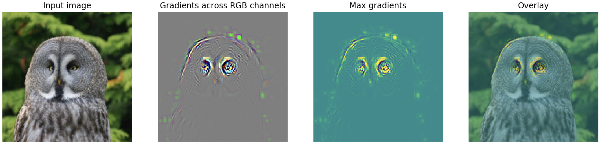
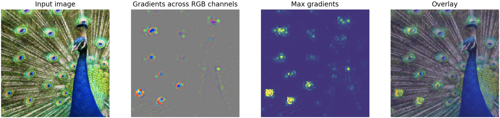
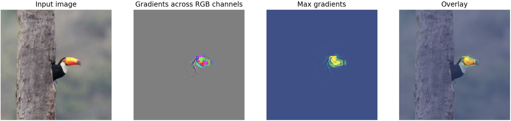
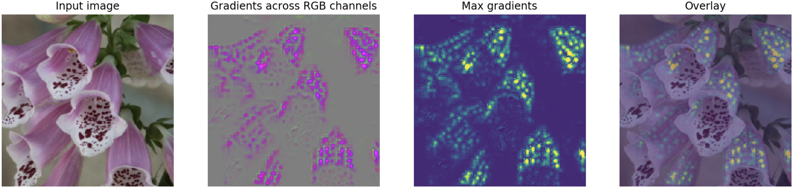
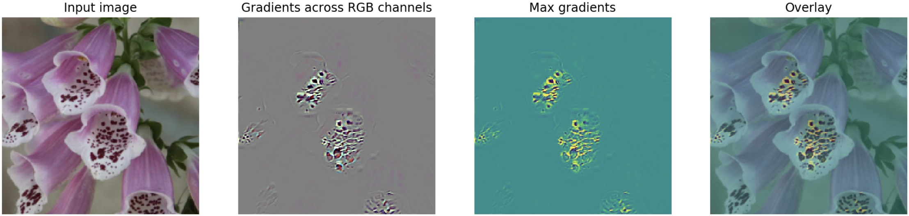

# FlashTorch :flashlight:

Visualisation toolkit implemented in PyTorch for inspecting what neural networks learn in image recognition tasks (feature visualisation).

The project is very much work in progress, and I would appreciate your feedback!

It currently supports visualisation of saliancy maps for all the models available under [torchvision.models](https://pytorch.org/docs/stable/torchvision/models.html).

## Installation

```bash
$ pip install flashtorch
```

## Usage (example notebooks)

- [Image handling](./examples/image_handling.ipynb)

- [Image-specific class saliency map with backpropagation](./examples/visualise_saliency_with_backprop.ipynb)

  - Notebook also available on [Google Colab](https://colab.research.google.com/github/MisaOgura/flashtorch/blob/master/examples/visualise_saliency_with_backprop_colab.ipynb)

## Examples of saliency maps in Alexnet, pre-trained on ImageNet dataset

Great gray owl (class index 24):



Peacock (class index 84):



Toucan (class index 96):



## Insignts on transfer learning

Densenet, pre-trained on ImageNet dataset, no additional training:



With training:



## Talks on FlashTorch

- [Hopperx1 London](http://www.cvent.com/events/hopperx1-london/agenda-e7d0f2fa5e9d46cf88fd8c322ae1290b.aspx), June 2019 - [slide deck](https://misaogura.github.io/flashtorch/presentations/Hopperx1London)

## Papers on feature visualisation

- Introduction and overview of feature visualisation: [Feature Visualization](https://distill.pub/2017/feature-visualization/)

- Latest development in feature visualisation: [Exploring Neural Networks with Activation Atlases](https://distill.pub/2019/activation-atlas/)

- Using backpropagation for gradient visualisation: [Deep Inside Convolutional Networks: Visualising Image Classification Models and Saliency Maps](https://arxiv.org/pdf/1312.6034.pdf)

- Guided backprobagation: [Striving for Simplicity: The All Convolutional Net](https://arxiv.org/pdf/1412.6806.pdf)

## Inspiration

- [pytorch-cnn-visualizations](https://github.com/utkuozbulak/pytorch-cnn-visualizations) by utkuozbulak

- [keras-vis](https://github.com/raghakot/keras-vis) by raghakot
