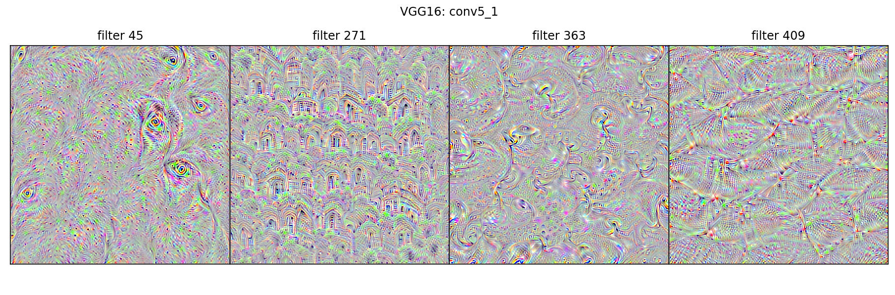

# FlashTorch

[](https://pypi.org/project/flashtorch/)
[](https://pypi.org/project/flashtorch/)
[](https://github.com/MisaOgura/flashtorch/blob/master/LICENSE)
[](https://zenodo.org/badge/latestdoi/177140934)

Visualizaion toolkit implemented in PyTorch for inspecting what neural networks learn in image recognition tasks (feature visualizaion).

The project is very much work in progress, and I would appreciate your feedback!

It currently supports visualizaion of saliency maps for all the models available under [torchvision.models](https://pytorch.org/docs/stable/torchvision/models.html).

## Overview

- [Installation](#installation)
- [API guide](#api-guide)
- [How to use](#how-to-use)
  - [Image handling](#image-handling)
  - [Saliency maps](#saliency-maps)
  - [Activation maximization](#activation-maximization)
- [Talks & blog posts](#talks--blog-posts)
- [Papers](#papers)
- [Inspiration](#inspiration)
- [Citation](#citation)
- [Author](#author)

## Installation

If you are installing `flashtorch` for the first time:

```bash
$ pip install flashtorch
```

Or if you are upgrading it:

```bash
$ pip install flashtorch -U
```

## API guide

An API guide is under construction, so this is a temporary workaround.

These are currently available modules.

- `flashtorch.utils`: some useful utility functions for data handling & transformation
- `flashtorch.utils.imagenet`: `ImageNetIndex` class for easy-ish retrieval of class index
- `flashtorch.saliency.backprop`: `Backprop` class for calculating gradients
- `flashtorch.activmax.gradient_ascent`: `GradientAscent` class for activation maximization

You can inspect each module with Python built-in function `help`. The output of that is available on [Quick API Guide](https://github.com/MisaOgura/flashtorch/wiki/Quick-API-Guide) for your convenience.

## How to use

Here are some handy notebooks showing examples of using `flashtorch`.

### Image handling

Notebook: [Image handling](./examples/image_handling.ipynb)

### Saliency maps


**[Saliency](https://en.wikipedia.org/wiki/Salience_(neuroscience))** in human visual perception is a _subjective quality_ that makes certain things within the field of view _stand out_ from the rest and _grabs our attention_.

**Saliency maps** in computer vision provide indications of the most salient regions within images. By creating a saliency map for neural networks, we can gain some intuition on _"where the network is paying the most attention to"_ in an imput image.

Example notebooks:

- [Image-specific class saliency map with backpropagation](https://github.com/MisaOgura/flashtorch/blob/master/examples/visualise_saliency_with_backprop.ipynb)
- [Google Colab version](https://colab.research.google.com/github/MisaOgura/flashtorch/blob/master/examples/visualize_saliency_with_backprop_colab.ipynb): best for playing around

### Activation maximization



[Activation maximization](https://pdfs.semanticscholar.org/65d9/94fb778a8d9e0f632659fb33a082949a50d3.pdf) is one form of feature visualization that allows us to visualize what CNN filters are "looking for", by applying each filter to an input image and updating the input image so as to maximize the activation of the filter of interest (i.e. treating it as a gradient ascent task with filter activation values as the loss).

Example notebooks:

- [Activation maximization](https://github.com/MisaOgura/flashtorch/blob/master/examples/activation_maximization.ipynb)
- [Google Colab version](https://github.com/MisaOgura/flashtorch/blob/master/examples/activation_maximization_colab.ipynb): best for playing around

## Talks & blog posts

- [Hopperx1 London](http://www.cvent.com/events/hopperx1-london/agenda-e7d0f2fa5e9d46cf88fd8c322ae1290b.aspx), June 2019 - [slide deck](https://misaogura.github.io/flashtorch/presentations/Hopperx1London)

- [Uncovering what neural nets “see” with FlashTorch](https://towardsdatascience.com/feature-visualisation-in-pytorch-saliency-maps-a3f99d08f78a)

- [Gaining insights on transfer learning with FlashTorch](https://towardsdatascience.com/gaining-insights-on-transfer-learning-with-flashtorch-de344df0f410)

## Papers

- Introduction and overview of feature visualizaion: [Feature Visualization](https://distill.pub/2017/feature-visualization/)

- The latest development in feature visualizaion: [Exploring Neural Networks with Activation Atlases](https://distill.pub/2019/activation-atlas/)

- Using backpropagation for gradient visualizaion: [Deep Inside Convolutional Networks: Visualising Image Classification Models and Saliency Maps](https://arxiv.org/pdf/1312.6034.pdf)

- Guided backprobagation: [Striving for Simplicity: The All Convolutional Net](https://arxiv.org/pdf/1412.6806.pdf)

## Inspiration

- [pytorch-cnn-visualizations](https://github.com/utkuozbulak/pytorch-cnn-visualizations) by utkuozbulak

- [keras-vis](https://github.com/raghakot/keras-vis) by raghakot

## Citation

```txt
Misa Ogura. (2019, July 8). MisaOgura/flashtorch: 0.0.8 (Version v0.0.8). Zenodo. http://doi.org/10.5281/zenodo.3271410
```

[](https://saythanks.io/to/MisaOgura)

## Author

### Misa Ogura

#### R&D Software Engineer @ [BBC](https://www.bbc.co.uk/rd/blog)

#### Co-founder of [Women Driven Development](https://womendrivendev.org/)

[Github](https://github.com/MisaOgura) | [Medium](https://medium.com/@misaogura) | [twitter](https://twitter.com/misa_ogura) | [LinkedIn](https://www.linkedin.com/in/misaogura/)
